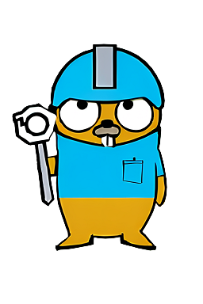

**其他语言版本: [English](README.md), [中文](README_zh.md).**

# 简介

该仓库旨在为 Golang 开发人员提供一系列实用且易于使用的工具，帮助他们提高开发效率和工作效率。这些工具涵盖了各种领域，包括算法库、容器库、缓存工具、文件处理、Http与Websocket网络、NoSql数据库访问等。

# 仓库特色
- 方案定位: 立足于解决微服务框架之外繁琐工作，与开发框架形成差异化互补。
- 易于集成: 低耦合，便于与各种项目集成，如go-zero. 
- 功能聚焦: 工具库涵盖了各种常见功能的工具实现，为了避免重复造轮子没有开发自己的SQL ORM，更加灵活的选用开源社区强大的ORM方案，站在巨人的肩膀才能走的更远。

# 目录
- [算法模块](algorithm/README_zh.md)
- [缓存模块](cache/README_zh.md)
- [yaml配置模块](conf/README_zh.md)
- [容器模块](container/README_zh.md)
- [数据库](db/README_zh.md)
- [日志库](log/README_zh.md)
- [网络库](net/README_zh.md)
- [通用工具库](utils/README_zh.md)
- [websocket客户端和服务端库](ws/README_zh.md)
